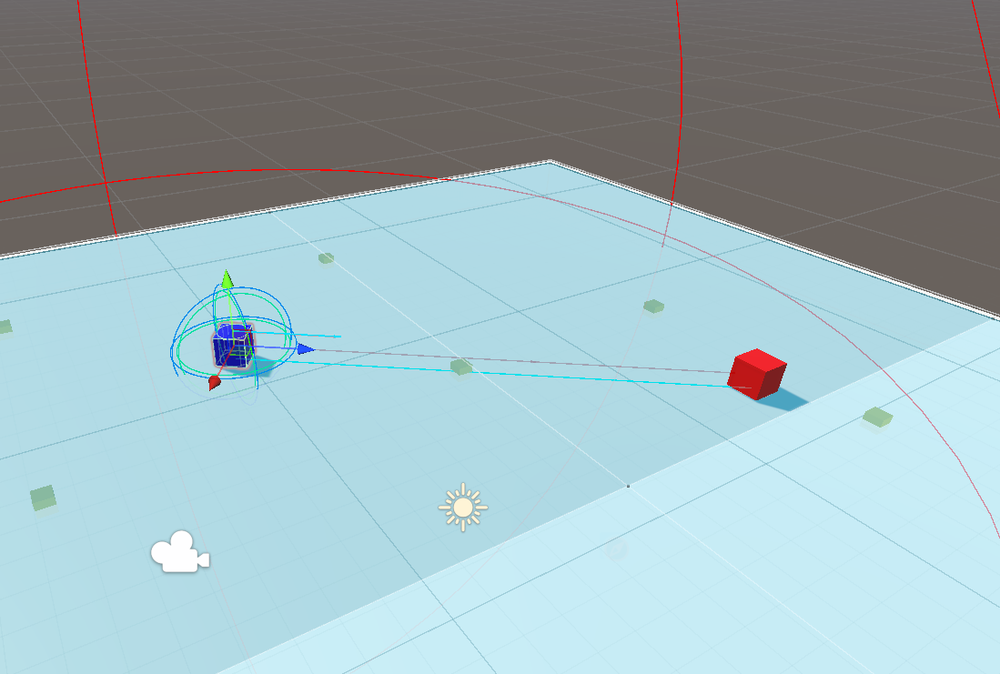
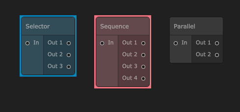
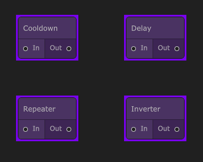
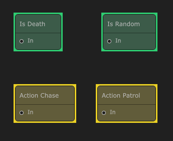

# MonsterAI

## 개요

MonsterAI는 유니티 게임 개발에 사용할 수 있는 Behavior Tree 기반 AI 시스템과 트리 구축을 편리하게 해주는 그래프 뷰 에디터를 제공합니다.

## 주요 기능

### 1. Behavior Tree 시스템

- 몬스터 및 NPC의 AI 행동을 트리 구조로 설계 가능
- 노드 기반의 행동 정의 및 조건 분기 지원
- 런타임에서 트리 평가 및 행동 실행

### 2. 그래프 뷰 에디터

- GUI 기반의 트리 생성 및 편집 기능
- 드래그 앤 드롭으로 노드 연결 및 배치
- 노드별 좌표 및 속성 시각화
- 트리 구조 저장 및 불러오기 지원

## 사용 방법

- 유니티 프로젝트에 패키지 추가
- Project 창에서 우클릭 > Create > Behavior Tree > Tree 생성
- 생성한 트리 선택 > 인스펙터 창 > Oppen Behavior Tree Editor 클릭 (에디터 창이 열립니다)
- 트리 생성 시 Select Node Type으로 루트 노드가 생성됩니다.
- 이후 Composite, Decorator, Leaf 노드를 추가하여 트리를 구성합니다.

### 노드 종류
#### 1. Composite

- 여러 자식 노드를 가지며, 조건에 따라 실행 순서를 결정 (예: Selector, Sequence)
- 시퀀스 노드는 자식 노드를 순차적으로 실행하고, 하나라도 실패하면 실패로 간주
- 셀랙트 노드는 자식 노드 중 하나라도 성공하면 성공으로 간주
- Output 노드를 여러 개 연결 할 수 있습니다.

#### 2. Decorator

- 자식 노드의 실행 결과를 수정하거나 조건을 추가 (예: Inverter, Repeater)
- Input과 Output 노드가 하나씩 존재

#### 3. Leaf

- 실제 행동을 수행하는 노드 (예: Action[노랑], Condition[초록])
- Input 노드만 존재
- 프로젝트의 성격에 따라 Action 노드와 Condition 노드를 구현하여 사용합니다.

## 구현 방식

### Behavior Tree

- 각 행동 노드는 ScriptableObject로 구현
- Composite, Decorator, Leaf 노드 패턴 적용
- 트리 순회 및 상태 관리 로직 포함

### 그래프 뷰

- UnityEditor의 GraphView API 활용
- 노드 및 그래프 뷰 커스텀 클래스 구현
- 사용자 입력에 따라 트리 구조 반영
- 데이터 직렬화 및 에디터 내 저장 기능

## Issue

- 그래프 뷰
  - 간선을 드래그 앤 드롭 하여 노드 생성 시 노드 간 연결이 자동으로 설정되지 않음
  - null 노드 참조 오류 발생 (구동에 문제 없음)
